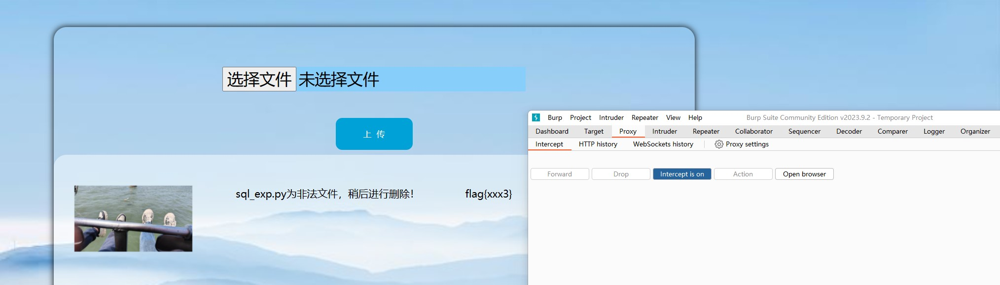

# 文件上传漏洞更新

## 问题所在

老师的`Reply`中提到【文件上传漏洞在被利用成功后，参赛选手可以直接远程完全控制靶机】的严重问题，我进行了问题定位。按照之前的逻辑，当我们成功修改恶意文件的`MIME`类型为允许上传的文件时，恶意文件就可以被正常上传。通过`URL`进行访问时，其恶意指令就会被执行，可以对我们的靶机环境进行控制，从而使得漏洞环境岌岌可危。

## 分析问题

### 上传前：对文件类型进行验证

我们通过文件的`MIME`类型来对文件是否允许上传进行判断。

### 上传时：对文件内容进行过滤和转义

我们想要对文件内容进行过滤。上传前是采用`MIME`类型进行区分是文本文件【只允许上传TXT格式】还是图片文件的。这里，我们再一次从【另外一种方式判断文件类型】，我们使用PHP内嵌的函数`getimagesize()`来判断。如果是图片文件，在我们的环境下，【默认】其是安全的。非图片文件则对文本内容进行过滤转义，通过获取上传文件的内容，并对其内容进行恶意代码的过滤，比如使用正则表达式对特殊符号进行处理，如 `<>$.`等，这会损失一定的【功能性】，但是【安全性】肯定是排在第一位的。保证安全的前提下，再一步步的优化功能。

### 上传后：对恶意文件进行检查 or 禁止访问URL

#### 禁止访问`URL`

用户上传恶意文件后，执行方式为访问`/upload/xx.php`，我就想到禁止通过`URL`对上传的文件进行访问，通过对apache2的配置文件进行相关设置的添加，禁止其对`/upload`目录下的文件进行访问。这样的操作的影响是，用户可以上传文件，但是不能访问`URL`。我们原始的模拟功能是上传图片并展示，但是此时新上传图片时，图片也无法加载。复制图片链接并打开自然也无法查看，这相比】文件内容过滤】造成的影响来说，无疑损失太大了。功能性几乎全部丧失。

#### 对恶意文件进行检查

如果恶意文件还是成功上传了，即便是对文件的内容进行过滤，但是一直将其留在环境中也是非常大的【隐患】，于是我便想着文件上传之后，再对恶意文件进行一个排查并删除。按照我们之前的构思，恶意文件通过修改MIME类型上传后，最终展示在页面上的后缀还是恶意文件的类型，如`.php`。这个时候，我们获取文件的后缀，并对不符合要求的文件进行删除操作。删除操作发生在重新进入此页面，或是再次进行文件上传操作的时候。

## `FLAG`设置

我也对FLAG的设置进行了优化，原本是执行恶意文件来获取`FLAG`，但是老师指出其存在的问题太过严重。这个时候，我把`FLAG`的获取逻辑改为，【成功上传非允许的文件类型】即为成功利用此漏洞。即在恶意文件检查的过程中，发现了恶意文件时，删除并给出`FLAG`。

## 总结

综上所述，在老师的建议下，我们添加了对恶意文件的上传时和上传后的处理手段，使得防护的过程更为完整和合理。同时，仍然存在一些问题，比如文件内容过滤不充分，图片中内嵌恶意代码等，仍然需要加强防护。

